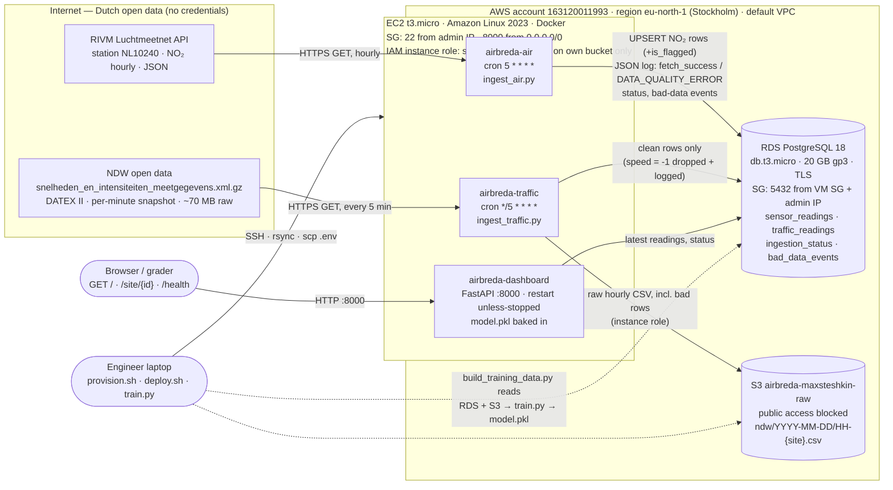

# AirBreda — Architecture Design Document

System Design &amp; Cloud Platforms · BUas ADSAI Year 3 · Max Steshkin · October 2026 
Live system: <a href="http://51.20.190.183:8000">http://51.20.190.183:8000</a> · Repository: <a href="https://github.com/MaksymSteshkin242689/airbreda">GitHub</a>

**Question the system answers:** does traffic congestion at the A27 interchange near Breda drive NO₂ exceedances at the nearby Luchtmeetnet station? AirBreda ingests two live Dutch open-data streams, stores them, trains a regression model on its own accumulated readings, and serves the result as a JSON API and a dashboard.

**Contents:** [1. Architecture](#1-architecture-as-deployed) · [2. ADRs](#2-architecture-decision-records) ([001](#adr-001-initial-data-storage-strategy) · [002](#adr-002-messaging-architecture) · [003](#adr-003-resilience-strategy) · [004](#adr-004-compute-strategy) · [005](#adr-005-compute--deployment-strategy) · [006](#adr-006-ml-serving-architecture)) · [3. Trade-offs](#3-trade-off-justifications) · [4. Provider rationale](#4-cloud-provider-rationale-for-the-municipality-of-breda) · [5. Cost](#5-cost-estimate) · [6. Reflection](#6-reflection)

---

## 1. Architecture (as deployed)

**Trust boundaries.** The only identity inside the cloud is the EC2 instance role, limited to `s3:ListBucket`, `s3:GetObject` and `s3:PutObject` on one bucket; no AWS access keys exist on the VM. Database credentials live in a git-ignored `.env`, copied over SSH and mounted with `--env-file`; the database accepts connections only from the VM's security group and the engineer's IP, over TLS. The dashboard port is the one thing exposed to the world — it is the deliverable. Admin credentials exist only on the engineer's laptop, for `infra/provision.sh`.

**Data model.** Four tables, created by four versioned SQL migrations (`db/migrations`, yoyo-migrations) that mirror how the schema evolved over the course: `sensor_readings` (Day 1), `is_flagged` + `ingestion_status` + `bad_data_events` (Day 2), `traffic_readings` (Day 3), `bad_data_events.reading_ts` (dedupe fix). Volume: 1 NO₂ row/hour + 4 sites × 12 snapshots/hour ≈ **49 rows/hour ≈ 1 200/day ≈ 430 000/year**.

**Three containers, one image each.** The two ingestion containers are short-lived: cron starts them, they fetch, write, log one JSON object per line, and exit. Because they exit, the Day 2 per-container `/health` and in-memory counters were replaced by the `ingestion_status` and `bad_data_events` tables; the dashboard's `/health` is the aggregate view over both sources. The dashboard runs continuously and logs every request as JSON too.

---

## 2. Architecture Decision Records

### ADR-001: Initial Data Storage Strategy

Day 1 · Status: accepted

**Context.** Two streams: hourly NO₂ (one station, one component) and per-minute traffic (four sites, intensity + speed). Both must be queried by site and time range for the dashboard, joined on the hour for training, and kept raw for future retraining under different cleaning rules. Volume is tiny (~430 k rows/year), the schema is fixed and flat, and there is no requirement for sub-second writes.

**Decision.** PostgreSQL on RDS for parsed readings, S3 for raw files, traffic written to **both**.

- *SQL over NoSQL.* The two real workloads are `WHERE site_id = ? ORDER BY timestamp DESC LIMIT 1` and a time-range join of two tables — what B-tree indexes and SQL joins are for. DynamoDB would push the join into application code; "it scales infinitely" is irrelevant at 1 200 rows/day.
- *Raw files in object storage.* Every parsed NDW reading is appended to `ndw/YYYY-MM-DD/HH-{site}.csv`, **including the rows the database refuses** (speed = -1). S3 is the audit trail and the retraining dataset: when a cleaning rule changes, the database holds only rows that survived *today's* rule, the bucket lets us replay history under tomorrow's.
- *Traffic in the database too.* The lab reads a site's latest intensity "from your bucket"; parsing a CSV out of S3 on every `/site/{id}` call would turn a 10 ms query into a 200 ms object fetch and couple the API to a second service. The database is the serving store, the bucket the raw store — the one place I knowingly departed from the lab text.
- *Duplicates.* Both jobs re-fetch overlapping windows on purpose (Luchtmeetnet: last 50 hours; NDW: the current minute) and write idempotently on the natural primary key: traffic with `ON CONFLICT DO NOTHING`; NO₂ with `ON CONFLICT DO UPDATE` restricted to one case — a row first stored as NULL (station had no value yet) is healed when the API later publishes it. Delivery is at-least-once, writes are idempotent, exactly-once is not attempted.

**Alternative rejected.** TimescaleDB: convenient for the hourly roll-up, but not offered on the RDS free tier, and `date_trunc('hour', …)` over a few hundred thousand rows completes in milliseconds — a dependency for no measurable benefit.

**Consequences.** Easier: joins, SQL analysis, a 60-line pandas training-set builder, idempotent reruns. Harder: two stores to keep consistent (S3 is written first and is the source of truth), and readers must know `traffic_readings` excludes sentinel rows.

---

### ADR-002: Messaging Architecture

Day 2 · Status: accepted (queue evaluated, not deployed)

**Context.** The Day 2 lab put a Redis list between the ingestion scripts and their consumers to experience producer/consumer decoupling. The production question is whether AirBreda needs a queue or topic between ingestion and storage, and which one.

**Decision.** **No broker in the deployed system**; both ingestion containers write directly to PostgreSQL and S3.

1. **Exactly one consumer.** A queue decouples a producer from *several* consumers; AirBreda has one, the database. The dashboard reads the database and the model is scored from the same rows at request time. A broker between one producer and one consumer decouples nothing and adds a process to run and monitor.
2. **Negligible volume, nobody waiting.** ≈ 49 rows/hour, written by cron jobs whose latency no user sees. The classic reason for a queue — keeping a request path fast by deferring work — does not apply.
3. **At-least-once already exists** through idempotent writes (ADR-001) plus three HTTP retries with back-off; a failed run records `ingestion_status.last_error` and the next cron run re-fetches the window.

If a broker is needed later — a second consumer, or ingestion outgrowing one VM — the choice is **Amazon SQS** (≈ 36 000 messages/month ≈ $0.01), not Redis: Redis was the right teaching tool and the wrong production broker (in-memory, single node, ours to operate); SQS is serverless, durable, with a dead-letter queue built in.

**If the broker — here, a store — goes down.** S3 is written first: if it is unreachable the traffic job fails before the database and that minute is lost (NDW publishes no history). If the database is unreachable, NO₂ loses nothing (the API keeps months of history) and traffic survives in S3 to be replayed. With SQS the shape would be the same: messages wait up to 14 days.

**Flag-and-keep versus drop.** A null or frozen NO₂ value is written with `is_flagged = TRUE` because a gap in an hourly series is worse than a flagged point: the dashboard can say "stale", training can exclude it, the row proves the pipeline ran. An NDW row with `speed = -1` stays out of the database because `-1` is a sentinel that would silently corrupt averages. *Same rule for both if I started over?* Partly: a lane with `flow = 0, speed = -1` means "no vehicles this minute" — a legitimate observation whose removal biases the training set toward busy hours, so the honest treatment there is the Luchtmeetnet rule (keep the flow, null the speed, flag). For `flow > 0, speed = -1` (a detector fault) dropping is right. The course rule is implemented as specified; every dropped reading is kept in S3 and `bad_data_events`, so the alternative can be applied retroactively.

**Consequences.** Three processes instead of four; failures visible as exit codes and `last_error`. Adding a consumer later means reading the database or introducing SQS — an afternoon, explicitly reversible.

---

### ADR-003: Resilience Strategy

Day 2 · Status: accepted

**Context.** A public-information dashboard for a municipality: useful, not life-safety. One VM, one availability zone. The university account's service control policy allows exactly one region (`eu-north-1`), so multi-region designs are unavailable even in principle.

**SLO.** **99.0 % availability for `GET /site/{id}`, measured monthly** (error budget 7 h 18 min), with a p95 latency SLI < 500 ms. 99.9 % (43 min/month) is not credible on one unmanaged VM — a kernel update with reboot or a `docker build` filling the 8 GB disk burns the whole budget; 99.5 % is the EC2 instance-level SLA itself and leaves no margin for our own mistakes. 99 % matches what the system *is*: one VM with `--restart unless-stopped` and Docker in systemd.

**DR tier: Backup & Restore.** RDS automated daily snapshots (1-day retention), raw data in S3 (11 nines), and a scripted rebuild (`infra/provision.sh` + `infra/deploy.sh`) that recreates everything in 20–30 minutes, dominated by RDS creation.

- **RTO ≈ 30–45 min**, plus communicating a new IP (the grader uses the IP, not a hostname).
- **RPO for processed data ≈ 0**: NO₂ is re-backfilled from the Luchtmeetnet API, traffic replayed from S3.
- **RPO for raw NDW capture = outage duration**: NDW publishes only the current minute, so snapshots during an outage are never captured — the one irrecoverable loss and the honest ceiling on resilience.

*Pilot Light* (standby RDS replica + pre-baked AMI) would add ≈ €13/month (+60 %) to protect against an AZ failure that a dashboard with a 7-hour monthly budget can ride out. *Warm Standby* (second VM + replica, ≈ +€22/month, +100 %) is out of proportion, and cross-region variants are forbidden by the account policy anyway.

**Consequences.** Nothing to keep in sync; the platform costs ≈ €23/month. A lost VM means 30+ minutes down and a new IP. Observability makes the budget manageable: every job writes `ingestion_status`, `/health` turns stale sources into `degraded`, and `BAD_DATA_THRESHOLD_EXCEEDED` is the alert hook.

---

### ADR-004: Compute Strategy

Day 3 · Status: accepted · extended by ADR-005

**Context.** Two containerised ingestion jobs that must run on a schedule, 24/7, from the cloud. Options: a VM with cron (IaaS), scheduled serverless (EventBridge Scheduler → Lambda / Fargate task), or a managed container service.

**Decision.** **One EC2 `t3.micro` running Docker, the two images triggered by cron** at `:05` hourly (air) and every 5 minutes (traffic, under `flock` so runs never overlap). It is the cheapest option with full control and a trivially debuggable runtime (`ssh`, `docker logs`); both jobs are tiny — the NDW job stream-parses a 70 MB XML in ~2 s with `iterparse`, stopping as soon as the four sites are found; and the same VM hosts the dashboard (ADR-005). Infrastructure is created by an idempotent AWS CLI script rather than Terraform — deliberate for a one-off, five-day deployment, where a 150-line shell script *is* the reproducibility record and state files plus `terraform import` of hand-made resources would cost more than they return.

**Cost.** From the AWS Price List API for `eu-north-1`: `t3.micro` $0.0108/h × 730 h = $7.88/month, plus 8 GB gp3 at $0.0836/GB-month → **≈ $8.55 ≈ €7.90/month**.

**At 50 corridors, ingesting every 5 minutes.** Less changes than intuition says: the NDW feed is *national*, so 50 corridors means extracting 200 site ids from the same download, not 50 downloads; Luchtmeetnet becomes 50 small calls per hour. The `t3.micro` would still cope with ingestion. What would not cope is the *operational model*: a service with real users on a single unmanaged VM that also runs the public endpoint. I would move the jobs to **EventBridge Scheduler → ECS Fargate tasks** (per-run billing, retries and dead-letter built in) and the dashboard to **App Runner** behind an ALB, keeping RDS but stepping up to `db.t3.small` Multi-AZ. The trigger is an SLO someone depends on, not CPU.

**Operational concerns I had not anticipated.** The organisation's SCP silently denies every region except `eu-north-1`, so the course's `eu-west-1` instructions failed with `UnauthorizedOperation`; the IAM user hit the 10-managed-policies quota and could not create the RDS service-linked role; and Amazon Linux 2023 ships without cron.

**Why the Redis queue is not here** — ADR-002: one consumer, 49 rows/hour, idempotent writes. A second consumer or ingestion outgrowing one VM brings a queue back, and then it is SQS.

**Consequences.** Easier: debugging and cost (<€10/month). Harder: a SPOF we patch ourselves, cron's only retry is "next run", secrets are a file on a disk. Disk exhaustion from image layers and logs is mitigated by `--rm`, `docker image prune` on deploy and log truncation in cron.

---

### ADR-005: Compute & Deployment Strategy

Day 4 · Status: accepted · extends ADR-004

**Context.** The dashboard (FastAPI, port 8000) must run continuously next to the two scheduled jobs: a third container on the same VM, or a managed container service for the one long-running piece.

**Decision.** **A third container on the same VM**, started with `docker run -d --restart unless-stopped -p 8000:8000`. This *extends* ADR-004: the compute choice is unchanged; the VM now also hosts a long-running, internet-facing process. A managed service for one container would double the deployment surface (two auth models, two log destinations, two deploy paths) to serve a handful of requests per hour. What would change my mind: real users and an SLO above 99 %, or the need for TLS and a hostname — App Runner's job, not a VM's.

**Long-term running and reboots.** Docker is enabled in systemd by the VM's user-data, the dashboard has `--restart unless-stopped`, cron is persistent: after a reboot the dashboard is back within seconds and the jobs run at their next scheduled minute. `infra/deploy.sh` is idempotent (rsync → build → migrate → crontab → restart → smoke test), and schema changes are versioned migrations applied as an explicit deploy step, never by a service at startup.

**What local testing caught before anything reached the VM.** The dashboard imported the site table from `ingest_traffic.py`, silently pulling `boto3` and `requests` into an image whose requirements lacked them — it would have crashed on import, so the table moved to a shared `sites.py`. The bad-data counter double-counted the same minute when the NDW feed had not advanced between two runs — fixed with a per-reading dedupe (migration 0004). And Luchtmeetnet's `timestamp_measured` turned out to be the *end* of the hour, which drives the alignment in ADR-006.

**Consequences.** One `deploy.sh`, one machine, one log stream. Building the scikit-learn image on a 1 GB VM needs the swap file user-data creates; a bad dependency can take the service down — hence Compose locally first. The public port and the cron jobs share one CPU, within the 500 ms p95.

---

### ADR-006: ML Serving Architecture

Day 4 · Status: accepted

**Context.** The API must return `no2_exceedance_risk ∈ [0, 1]` per site, from a model trained on the pipeline's own data. Traffic collection started on 1 October 2026 at 19:35 UTC, so at training time the pipeline had 20 joined hourly rows — below the ~24 the course calls "a day's worth" and all from autumn weekday hours.

**The model.** `LinearRegression` on two features: `total_intensity_veh_per_hr` (sum of the four sites' hourly mean intensity) and `hour_of_day` (local time). With a few dozen rows, two coefficients are the right amount of model: anything more flexible would fit noise and could not be sanity-checked, whereas a linear model's coefficients *are* the sanity check: the traffic coefficient should be positive, and on these 20 hours it is not (see §6 for why). A full year of data (≈ 8 700 rows) with weather features would justify a gradient-boosted model with a time-based hold-out.

| rows | evaluation | R² | MAE (µg/m³) | coef. intensity | coef. hour | intercept |
|---|---|---|---|---|---|---|
| 20 | in-sample (too few rows for a meaningful hold-out) | 0.026 | 5.30 | -0.00066 | -0.005 | 33.26 |

With this little data the R² is an in-sample fit statistic, not a generalisation estimate; the MAE is in the municipality's units and is the number to watch; the sign of the intensity coefficient is a direction check, not causality — and here it fails. This model demonstrates the pipeline, it is not production-grade — see §6.

**Exceedance risk.** A logistic curve centred on a threshold: `risk = 1 / (1 + exp(-0.2 · (predicted − 40)))`, so 0.5 at 40 µg/m³, ≈ 0.88 at 50, ≈ 0.12 at 30. **40 µg/m³ is the EU annual limit value for NO₂** and the level Breda reports against; applied to hourly predictions, "risk" means "this hour runs above the level the city tries to stay under on average", not a legal hourly exceedance (that limit is 200 — hourly values here sit between 10 and 50, so 200 would return ≈ 0 all year). A logistic classifier on an "above 40" label was rejected: with few positive hours it would train on a handful of ones.

**Training-serving skew** is the same feature name computed differently in training and serving. Three places it could happen here, one mechanism each: (1) `hour_of_day` — UTC vs local; one function, `predict.hour_of_day_from` (Europe/Amsterdam), used by both training and the dashboard. (2) Total intensity — the model is trained on the **hourly mean** per site, so serving feeds it the trailing-hour mean of clean snapshots, not the latest minute (several times the variance, a different feature in disguise), with the identical missing-site rule. (3) Alignment — Luchtmeetnet's timestamp is the *end* of the hour, so traffic for 17:00–18:00 joins the NO₂ value stamped 18:00, and serving takes `hour_of_day` from the measurement time, not the wall clock. Baking `model.pkl` into the image closes a fourth door: model and feature code ship as one artefact, so a retrained model can never meet stale feature code in production.

**One station for four sites.** All four NDW sites sit at hectometre 63 of the A27, the interchange station NL10240 monitors; the unit of prediction is the interchange, so predicted NO₂ and risk are identical across the four sites, computed from their *total* traffic (`prediction_basis` in the response makes this explicit). A second interchange would need its own station (NL10241, Breda-Bastenakenstraat, is the nearest) and its own model; a station standing in for a location kilometres away is the "stand-in reading" the course warns about.

**If `predict()` fails** the request still returns HTTP 200 with the real measurements, `null` prediction fields and a `prediction_error`, plus a structured `prediction_failed` log event. The measurements do not depend on the model and are the valuable part; failing the request would turn a model problem into an outage against ADR-003's budget while hiding the cause behind a 500.

**Consequences.** A model anyone can read off two coefficients, no model server, no feature store. Retraining is a rebuild; per-site nuance is impossible; the threshold is a policy constant. The model knows nothing about weekends, wind or season — §6.

---

## 3. Trade-off Justifications

**Storage.** Considered: PostgreSQL (RDS), DynamoDB, TimescaleDB, S3-only with Athena. Chose RDS PostgreSQL for parsed rows + S3 for raw files. Gave up: schemaless flexibility and "infinite" write scaling we will never need at 49 rows/hour, and the convenience of hypertables. Numbers: 430 k rows/year ≈ 40 MB/year; `db.t3.micro` + 20 GB gp3 = $16.27/month; S3 for a year of hourly CSVs ≈ 100 MB ≈ $0.002/month. Latency: latest-reading query 2–15 ms over TLS from the VM.

**Compute.** Considered: EC2 + cron, EventBridge Scheduler + Fargate tasks, App Runner for the dashboard, Kubernetes. Chose one `t3.micro` for all three containers. Gave up: zero-ops patching, auto-restart on hardware failure, horizontal scaling, TLS/hostname out of the box. Numbers: $8.55/month vs. roughly $25–35/month for Fargate tasks + App Runner (minimum provisioned instance) at this load; a 2-second NDW parse every 5 minutes is <1 % of the VM's CPU.

**Messaging.** Considered: direct writes, Redis list (lab), SQS, Kinesis. Chose direct writes with idempotent upserts. Gave up: decoupling we have no second consumer for, and buffering we have no burst for. Numbers: SQS would cost ≈ $0.01/month for 36 k messages, so cost was never the argument — operational surface and the absence of a consumer were. Reversal cost: an afternoon, if a second consumer appears.

**Disaster recovery.** Considered: Backup & Restore, Pilot Light, Warm Standby, Active-Active. Chose Backup & Restore with a 99 % SLO. Gave up: minutes-level RTO and protection against an AZ failure. Numbers: RTO 30–45 min, RPO 0 for processed data, RPO = outage length for raw NDW capture (irrecoverable upstream); Pilot Light +≈ €13/month (+60 %), Warm Standby +≈ €22/month (+100 %), multi-region not permitted by the account's SCP.

---

## 4. Cloud Provider Rationale for the Municipality of Breda

*Written for a policy officer; no technical background assumed.*

AirBreda runs on **Amazon Web Services (AWS)**, in Amazon's Stockholm data centres, inside the European Union. Here is what that choice gives the municipality, why it fits a Dutch public body, and what we would lose by switching.

**What it gives us.** Three things. First, we rent only what we use: one small computer that collects the measurements and shows the dashboard, one managed database, and a storage locker for the raw files. Together that is about **€25 a month**, with no hardware to buy and nothing to replace when it breaks — Amazon replaces it. Second, the parts that are easy to get wrong are handled for us: the database is backed up every night automatically, the storage is designed so that losing a file is practically impossible, and security updates to the underlying machines are not our problem. Third, everything is written down as a script. If the computer disappeared tonight, a colleague could rebuild the whole system from that script tomorrow morning in under an hour.

**Why it suits a public body in the Netherlands.** The data never leaves the EU: it is stored in Sweden, under European law, and AWS's standard contract commits to the GDPR's data-processing rules — an arrangement many Dutch public bodies already use. The data itself is public open data (air quality from the RIVM, traffic counts from the national road authority) with no personal information, so the privacy exposure is low to begin with. AWS is also the platform most Dutch IT suppliers already know, which matters when the municipality asks a contractor to maintain or extend the system.

**What we would lose by switching.** Moving to Microsoft Azure would not lose any *capability* — the equivalent services exist — but it would cost roughly a week of engineering to redo the setup scripts, security rules and database, with the dashboard offline meanwhile, for no gain in price or quality. Moving to a Dutch-only hosting company would gain national data residency, which this public dataset does not need, and lose the automatic backups, the pay-per-use billing and the pool of people who know the platform. For a €25-a-month public dashboard, the provider matters far less than having the system written down so it can be rebuilt. AWS is a sound, boring choice, and boring is what public infrastructure should be.

---

## 5. Cost Estimate

Prices from the official AWS Price List API for `eu-north-1` (Stockholm), on-demand, October 2026, cross-checked against [calculator.aws](https://calculator.aws); EUR at €0.92/$. A "corridor" is one air-quality station plus its set of NDW sites (four here). Storage is sized at 12 months of history.

| Component | Current (1 corridor) | At 10 corridors | At 50 corridors |
|---|---|---|---|
| **Compute (VM)** — `t3.micro` $0.0108/h + 8 GB gp3 | $8.55 ≈ **€7.90** | $8.55 ≈ **€7.90** (same VM; one national NDW download serves all) | **€0** VM → ECS Fargate tasks ≈ $6 + App Runner dashboard ≈ $26 ≈ **€29** |
| **Database** — `db.t3.micro` $0.019/h + gp3 $0.12/GB | 20 GB → $16.27 ≈ **€15.00** | 20 GB → $16.27 ≈ **€15.00** (0.4 GB/yr of rows) | `db.t3.small` Multi-AZ $0.076/h + 50 GB → $61.50 ≈ **€56.60** |
| **Object storage** — S3 $0.023/GB-month + requests | 0.1 GB, 105 k PUT/yr → $0.53 ≈ **€0.50** | 1 GB → $0.60 ≈ **€0.55** | 5 GB, 5 M PUT → $1.30 ≈ **€1.20** |
| **Total / month** | **≈ €23.40** | **≈ €23.45** | **≈ €86.80** |

Volumes behind the table: per corridor 1 NO₂ row/hour + 4 sites × 12 snapshots/hour ≈ 1 200 rows/day ≈ 40 MB/year in Postgres, and ≈ 35 k hourly CSV files/year ≈ 70 MB in S3. Egress for a dashboard with tens of requests/hour is well under the 100 GB/month free allowance.

**Is a single VM still the right compute at 10 and 50 corridors?** At **10**, yes — the counter-intuitive result is that cost does not move: the NDW feed is one national file, so ten corridors means parsing 40 site ids out of the same 70 MB download, and Luchtmeetnet is ten small calls per hour. At **50**, the single VM is still not CPU-bound, but it is the wrong *shape*: fifty corridors is a service the municipality depends on, which needs an SLO above 99 %, TLS and a hostname, and a deploy path that does not involve SSH. That is the threshold ADR-004/005 describe — move the jobs to scheduled Fargate tasks and the dashboard to App Runner behind a load balancer, and pay about 3.7× for it.

---

## 6. Reflection

**The decision I am least confident in** is the NDW bad-data rule: dropping any site-minute in which a lane reports `speed = -1`. It is what the course specifies and it keeps sentinel values out of averages, but after one night of data it is clear that the sentinel fires constantly on the slip roads and sometimes on the mainline whenever a lane is empty for a minute — the counter crossed the 10-per-hour alert threshold every night, which is alert fatigue in miniature. Those minutes are not bad data; they are *zero traffic*, which is precisely the regime a traffic→NO₂ model needs to see. I suspect the rule biases the training set toward busy hours. To become confident I would compare two models trained from the same S3 archive — one under the course rule, one keeping `flow = 0 / speed = -1` lanes as zero-flow observations — on a held-out day. The raw CSVs exist for exactly this reason; the experiment is an afternoon, not a redesign.

**The coefficient has the wrong sign, and the data say why.** Over the 20 hours collected, the busiest hours (13:00–17:00 local, 4 200–4 800 veh/h) had the *lowest* NO₂ (18–25 µg/m³) and the quiet night (400–1 200 veh/h) sat at 27–37: afternoon sun mixes the boundary layer and dilutes NO₂ faster than traffic adds it, and the night inversion traps it. One day of data cannot separate traffic from meteorology, so the regression learns the diurnal cycle, not the causal effect. That is the strongest argument in this document for weather features.

**With a full year of readings** the *features* would add what actually drives NO₂ beyond traffic: wind speed and direction (KNMI's open API is free), temperature, weekday/weekend, and lagged NO₂ — the most predictive feature for the next hour is the current hour. The *algorithm* would move to something that represents interactions (gradient boosting, or a GAM if interpretability matters more than the last few percent), because the traffic–NO₂ relationship is conditional on wind. The *evaluation* is where a year matters most: a random split on hourly data leaks through autocorrelation; the honest protocol is a time-based split and a "predict last hour's value" baseline that a model must beat. Today's model is evaluated in-sample on 20 hours and says so in its metrics file.

**The first thing I would add for a real production system** is a CI/CD pipeline with the test suite as a gate: today a deploy is `./infra/deploy.sh` from a laptop — reproducible, but dependent on one machine and one SSH key. GitHub Actions running `pytest` and then the same deploy over SSH with OIDC-issued credentials removes the laptop from the path and makes every change reviewable. Close behind it: TLS and a hostname via a load balancer or App Runner (an open port on a raw IP is fine for a grader, not for a municipality), and a weekly retraining job that opens a pull request with the new `metrics.json`, so model drift becomes a diff someone reads rather than a surprise.

**What I would do differently** is smaller than I expected. Start data collection in the first hour of Day 1, not Day 3 — every hour of traffic not captured is gone forever, and the model's quality on Day 5 was set by that clock. Probe the account's guardrails (region policy, IAM quotas) before building, not after tripping over them. The architecture itself — two small jobs, one relational store, one raw store, one process serving an API that its own dashboard consumes — I would build the same way again.
