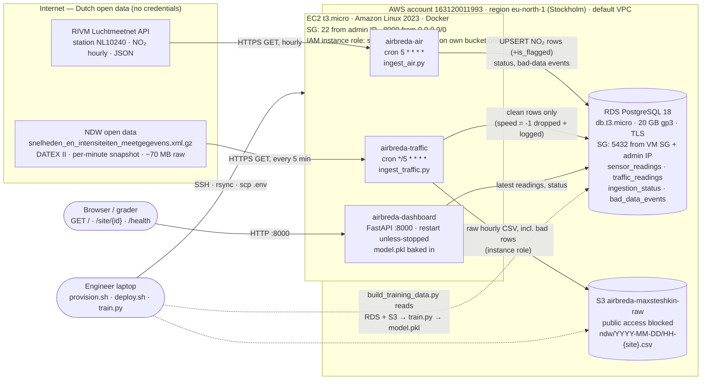

# AirBreda — Architecture Design Document

System Design &amp; Cloud Platforms · BUas ADSAI Year 3 · Max Steshkin · October 2026 
Live system: <a href="http://VM_IP_PLACEHOLDER:8000">http://VM_IP_PLACEHOLDER:8000</a> · Repository: <a href="REPO_URL_PLACEHOLDER">GitHub</a>

**Question the system answers:** does traffic congestion at the A27 interchange near Breda drive NO₂ exceedances at the nearby Luchtmeetnet station? AirBreda ingests two live Dutch open-data streams, stores them, trains a regression model on its own accumulated readings, and serves the result as a JSON API and a dashboard.

**Contents:** [1. Architecture](#1-architecture-as-deployed) · [2. ADRs](#2-architecture-decision-records) ([001](#adr-001-initial-data-storage-strategy) · [002](#adr-002-messaging-architecture) · [003](#adr-003-resilience-strategy) · [004](#adr-004-compute-strategy) · [005](#adr-005-compute--deployment-strategy) · [006](#adr-006-ml-serving-architecture)) · [3. Trade-offs](#3-trade-off-justifications) · [4. Provider rationale](#4-cloud-provider-rationale-for-the-municipality-of-breda) · [5. Cost](#5-cost-estimate) · [6. Reflection](#6-reflection)

---

## 1. Architecture (as deployed)

**Trust boundaries.** The only identity inside the cloud is the EC2 instance role, and it can do exactly three things on exactly one bucket (`s3:ListBucket`, `s3:GetObject`, `s3:PutObject` on `airbreda-maxsteshkin-raw`); no AWS access keys exist on the VM. Database credentials live in a git-ignored `.env` that is copied to the VM over SSH and mounted into the containers with `--env-file`. The database is reachable only from the VM's security group and the engineer's IP, over TLS (`sslmode=require`). The dashboard port is the single thing exposed to the world, on purpose: it is the deliverable. The engineer's laptop holds the admin credentials used by `infra/provision.sh`; nothing at runtime needs them.

**Data model.** Four tables, created by four versioned SQL migrations (`db/migrations`, yoyo-migrations) that mirror how the schema actually evolved over the course days: `sensor_readings` (Day 1, PK `(station_id, timestamp, component)`), `is_flagged` + `ingestion_status` + `bad_data_events` (Day 2), `traffic_readings` (Day 3, PK `(site_id, timestamp)`), `bad_data_events.reading_ts` (dedupe fix). Volume today: 1 NO₂ row/hour + 4 sites × 12 snapshots/hour ≈ **49 rows/hour ≈ 1 200/day ≈ 430 000/year** — a few tens of MB.

**Three containers, one image each.** `airbreda-air` and `airbreda-traffic` are short-lived: cron starts them, they fetch, write, log JSON, and exit. `airbreda-dashboard` runs continuously. All three log one JSON object per line to stdout; `/health` is computed from the `ingestion_status` table, which is the only place the cron jobs' state survives.

---

## 2. Architecture Decision Records

### ADR-001: Initial Data Storage Strategy

Day 1 · Status: accepted

**Context.** Two streams must be stored: hourly NO₂ values (one station, one component) and per-minute traffic readings (four sites, intensity + speed). Both must be queried by site/station and time range for the dashboard, joined on the hour for model training, and kept raw for future retraining under different cleaning rules. Expected volume is tiny by database standards (~430 k rows/year) and the schema is fixed and flat: `(id, timestamp, metric, value)`. There is no requirement for sub-second writes or for unbounded schema evolution.

**Decision.** A relational database (PostgreSQL on Amazon RDS) for parsed readings and an object store (Amazon S3) for raw files, with traffic written to **both**.

- *SQL over NoSQL.* Readings are perfectly tabular, the two workloads the system actually has are `WHERE site_id = ? ORDER BY timestamp DESC LIMIT 1` and a time-range join of two tables — exactly what B-tree indexes on `(site_id, timestamp)` and SQL joins are for. DynamoDB would need either a scan or a hand-built secondary index to answer "join NO₂ to traffic by hour", and the join would move into application code. The "it scales infinitely" argument is irrelevant at 1 200 rows/day; a `db.t3.micro` will not notice ten years of this data.
- *Raw files in object storage.* Every parsed NDW reading is appended to `ndw/YYYY-MM-DD/HH-{site}.csv`, **including the rows the database refuses** (speed = -1). S3 is the audit trail and the retraining dataset: when we change a cleaning rule six months from now, the database only contains rows that survived *today's* rule, the bucket lets us replay history under tomorrow's rule. It costs €0.02/GB-month and has eleven nines of durability; it cannot serve an indexed point query, which is why it is not the only store.
- *Traffic in the database too.* The course text reads a site's latest intensity "from your bucket". Parsing a CSV out of S3 on every `/site/{id}` call would turn a 10 ms query into a 200 ms object fetch and make the API depend on a second service. The database is the serving store; the bucket is the raw store. This is the one place I knowingly departed from the lab text.
- *Duplicates.* Both ingestion jobs re-fetch overlapping windows on purpose (Luchtmeetnet: the last 50 hours; NDW: whatever minute is current) and write with `INSERT … ON CONFLICT DO NOTHING` on the natural primary key. Delivery is at-least-once; the write is idempotent; exactly-once is not needed and not attempted (Day 1: "an over-engineering trap"). The hourly CSV in S3 is appended with the same rule (one row per measurement minute).

**Alternative considered and rejected.** *TimescaleDB / a managed time-series store.* The hypertable partitioning and continuous aggregates would be convenient for the hourly roll-up, but RDS does not offer the extension on the free tier, and at this volume a plain `date_trunc('hour', …)` GROUP BY over a few hundred thousand rows completes in milliseconds. It would add a dependency for no measurable benefit until the row count is in the hundreds of millions.

**Consequences.** Easier: joins, ad-hoc analysis with SQL, a training-set builder that is 60 lines of pandas, idempotent reruns. Harder: two stores to keep consistent (mitigated by writing S3 first and treating it as the source of truth), and the raw-vs-clean split means a reader must know that `traffic_readings` excludes sentinel rows. Risk: if the 5-minute cadence ever becomes 1-minute across 50 corridors, the row rate (~15 k/hour) is still fine for Postgres, but the read-modify-write append to hourly CSVs in S3 should become one object per snapshot.

---

### ADR-002: Messaging Architecture

Day 2 · Status: accepted (queue evaluated, not deployed)

**Context.** The Day 2 lab introduced a Redis list as a message broker between the two ingestion scripts and their consumers, to experience producer/consumer decoupling. The production question is whether AirBreda needs a queue or topic between ingestion and storage, and which one.

**Decision.** **No broker in the deployed system.** Both ingestion containers write directly to PostgreSQL and S3. The reasons, in order of weight:

1. **There is exactly one consumer.** A queue decouples a producer from *several* consumers (a database writer, an ML scorer, an anomaly detector). AirBreda has one: the database. The dashboard reads the database, and the model is scored at request time from the same rows. A broker between one producer and one consumer decouples nothing; it adds a process that must be run, monitored and kept alive.
2. **Write volume is negligible.** ≈ 49 rows/hour. A synchronous `INSERT` from a cron job is finished in milliseconds; there is no back-pressure to absorb.
3. **Nobody is waiting.** The ingestion jobs run on a schedule and exit. Latency of the write path is invisible to any user. The classic reason for a queue — keep the request path fast by deferring work — does not apply.
4. **Idempotent writes already give at-least-once semantics for free** (ADR-001). The retry loop is three HTTP attempts with back-off inside the job; if the database is down the job exits non-zero, the failure is recorded in `ingestion_status.last_error`, and the next cron run re-fetches the same window.

*If a broker is needed later* — a second consumer, or ingestion outgrowing one VM — the choice is **Amazon SQS** (standard queue, $0.40 per million requests; AirBreda would generate ~36 000 messages/month ≈ $0.01), not Redis. Redis was the right teaching tool (one container, zero cloud setup) and the wrong production broker: it is in-memory, single-node unless we run a cluster, and would make us the operators of a stateful service. SQS is serverless, durable, and has a dead-letter queue built in.

**What happens to readings if the broker goes down?** In the deployed design there is no broker, so the failure modes are the two stores. If S3 is unreachable the traffic job fails before touching the database (S3 is written first) and the minute is lost from *our* copy — NDW publishes no history, so that is a real, if tiny, data loss (one 1-minute snapshot per failed 5-minute poll). If the database is unreachable, nothing is lost for NO₂ (Luchtmeetnet keeps months of history; the next run re-fetches 50 hours) and traffic survives in S3 to be replayed into the database. With SQS in the picture the answer would be the same shape: messages wait in the queue for up to 14 days; the producer's retry covers the API-to-queue hop.

**Flag-and-keep (Luchtmeetnet) versus drop (NDW).** A null or frozen NO₂ value is written with `is_flagged = TRUE` because a gap in an hourly time series is worse than a flagged point: the dashboard can show "stale", the training set can exclude it, and the row proves the pipeline ran. An NDW row with `speed = -1` is excluded from the database because `-1` is a sentinel, not a measurement, and letting it into a column consumers average over would silently corrupt aggregates. *Would I apply the same rule to both if I started over?* Partly. For a lane with `flow = 0` and `speed = -1` the sentinel actually means "no vehicles in this minute", which is a legitimate, informative observation (low traffic → low NO₂), and dropping it biases the training set toward busy hours; the honest treatment is "keep the flow, null the speed, flag the row", i.e. the Luchtmeetnet rule. For `flow > 0` with `speed = -1` (a detector fault) dropping is right. The system implements the course rule as specified and records every dropped reading in S3 and `bad_data_events`, so the alternative rule can be applied retroactively.

**Consequences.** Easier: three processes instead of four, no broker to size or monitor, failures are visible as exit codes and `last_error`. Harder: adding a second consumer later means either reading from the database (fine for batch) or introducing SQS then. Risk: none at this scale; the decision is explicitly reversible.

---

### ADR-003: Resilience Strategy

Day 2 · Status: accepted

**Context.** AirBreda is a public-information dashboard for a municipality: useful, not life-safety. It runs on a single VM in a single availability zone. The university account's service control policy allows exactly one region (`eu-north-1`), so multi-region designs are not available even in principle.

**Decision — SLO.** **99.0 % availability for `GET /site/{id}`, measured monthly** (error budget: 7 h 18 min/month), with a latency SLI of p95 < 500 ms. 99.9 % (43 min/month) is not credible on one unmanaged VM: a single Amazon Linux kernel update with reboot, or one `docker build` that fills the 8 GB disk, burns the whole budget. 99.5 % (3 h 39 min) is what the EC2 instance-level SLA itself promises and leaves zero margin for our own mistakes. 99 % matches what the system *is* — one VM with `--restart unless-stopped` and Docker enabled in systemd — and is honest to the municipality.

**Decision — DR tier: Backup & Restore.** RDS automated daily snapshots (1-day retention), raw data in S3 (11 nines), and a scripted rebuild: `infra/provision.sh` + `infra/deploy.sh` recreate the VM, images, cron and dashboard from a clean account in about 20–30 minutes, dominated by RDS instance creation. Recovery objectives:

- **RTO ≈ 30–45 min** (rebuild time + DNS-free, since the grader uses the IP: a new IP must be communicated).
- **RPO for processed data ≈ 0**: `sensor_readings` is re-backfilled from the Luchtmeetnet API (months of history), `traffic_readings` is replayed from the CSVs in S3.
- **RPO for raw NDW capture = outage duration**: NDW publishes only the current minute, so traffic snapshots during an outage are never captured. This is the one irrecoverable loss in the system and the honest ceiling on its resilience.

Why not higher: *Pilot Light* (a standby RDS replica + a pre-baked AMI) would add ~€13/month (+60 %) to protect against an AZ failure that, for a dashboard with a 7-hour monthly budget, is cheaper to ride out. *Warm Standby* (second VM + replica, ≈ +€22/month, +100 %) and *Active-Active* are out of proportion for the use case, and cross-region variants are forbidden by the account policy anyway.

**Consequences.** Easier: nothing to keep in sync, the whole platform is ~€25/month. Harder: a lost VM means 30+ minutes of downtime and a new IP; a kernel panic at night is a morning problem. Observability is what makes the budget manageable: every job writes `ingestion_status`, `/health` turns stale sources into `degraded`, and the `BAD_DATA_THRESHOLD_EXCEEDED` log line is the alert hook.

---

### ADR-004: Compute Strategy

Day 3 · Status: accepted · extended by ADR-005

**Context.** Two containerised ingestion jobs that must run on a schedule, 24/7, from the cloud. Options: a VM with cron (IaaS), scheduled serverless (EventBridge Scheduler → Lambda / ECS Fargate task), or a managed container service.

**Decision.** **One EC2 `t3.micro` (2 vCPU, 1 GB, Amazon Linux 2023) running Docker, with the two images triggered by cron** at `:05` hourly (air) and every 5 minutes (traffic). Reasons: it is the cheapest option that gives full control and a trivially debuggable runtime (`ssh`, `docker logs`); both jobs are tiny (the NDW job streams and parses a 70 MB XML in ~2 s with `iterparse`, stopping as soon as the four sites are found); and the same VM hosts the dashboard (ADR-005), so one machine is the whole platform. Infrastructure is created by an idempotent AWS CLI script rather than Terraform — a deliberate call for a one-off, five-day deployment where a 150-line shell script *is* the reproducibility record, and the state file, provider pinning and `terraform import` of hand-made resources would cost more than they return.

**Cost.** From the official AWS Price List API for `eu-north-1`: `t3.micro` on-demand $0.0108/h × 730 h = **$7.88/month**, plus 8 GB gp3 at $0.0836/GB-month = $0.67 → **≈ $8.55 ≈ €7.90/month** (Free Tier credits cover this in the first year).

**What changes at 50 corridors, ingesting every 5 minutes.** Less than intuition says: the NDW feed is *national* — one download already contains every site in the Netherlands, so 50 corridors means extracting 200 site ids from the same file, not 50 downloads. Luchtmeetnet becomes 50 small API calls per hour. The `t3.micro` would still cope with ingestion; what would not cope is the *operational model*: 50 corridors is a real service with real users, and a single unmanaged VM is a single point of failure that also runs the public endpoint. I would move the two jobs to **EventBridge Scheduler → ECS Fargate tasks** (no idle VM to patch, per-run billing, retries and dead-letter built in) and the dashboard to **App Runner** behind an ALB, keeping RDS but stepping up to `db.t3.small` with Multi-AZ. The trigger is organisational (an SLO someone depends on), not CPU.

**Operational concerns I had not anticipated.** Three, all real: (1) the university AWS organisation's SCP silently denies every region except `eu-north-1`, so the course's `eu-west-1` instructions did not apply and the first provisioning attempt failed with `UnauthorizedOperation`; (2) the IAM user hit the 10-managed-policies quota and could not even create the RDS service-linked role until the policies were replaced by `AdministratorAccess`; (3) cron's minimal `PATH` and the need for absolute `/usr/bin/docker`, plus log files that grow forever on an 8 GB disk — hence the truncate job in `infra/crontab.txt`.

**Why the Redis queue from ADR-002 is not here.** One consumer, ~49 rows/hour, no latency requirement, idempotent writes: a broker adds a fourth process with nothing to decouple. What would bring it back: a second consumer of readings (online scoring, alerting) or ingestion outgrowing a single VM — and then it would be SQS.

**Consequences.** Easier: debugging (`docker logs`, `psql` from the VM), cost (<€10/month compute), one place to look. Harder: the VM is a SPOF that we patch ourselves; cron has no retry semantics beyond "next run"; secrets are a file on a disk. Risk: disk exhaustion from image layers and logs — mitigated by `--rm`, `-q` builds and log truncation.

---

### ADR-005: Compute & Deployment Strategy

Day 4 · Status: accepted · extends ADR-004

**Context.** The dashboard (FastAPI, port 8000) must run continuously next to the two scheduled jobs. Options: a third container on the same VM, or a managed container service for the one long-running piece.

**Decision.** **A third container on the same VM**, started with `docker run -d --restart unless-stopped -p 8000:8000`. This *extends* ADR-004 rather than superseding it: the compute choice (one `t3.micro`) is unchanged; what changes is that the VM now also hosts a long-running, internet-facing process. A managed service for one container would have doubled the deployment surface (two auth models, two log destinations, two deploy paths) to serve a handful of requests per hour. What would change my mind: the dashboard getting real users (and therefore an SLO above 99 %), or needing TLS and a hostname — both are App Runner's job, not a VM's.

**Long-term running and reboots.** Docker is enabled in systemd by the VM's user-data; the dashboard container has `--restart unless-stopped`; cron is persistent. After a reboot all three come back without intervention: the dashboard within seconds, the ingestion jobs at their next scheduled minute. The deploy script is idempotent and re-runnable (`infra/deploy.sh`: rsync → build → migrate → crontab → restart → smoke test), and database schema changes are versioned migrations applied as an explicit deploy step, never implicitly by a service on startup.

**What local testing caught before anything reached the VM.** (1) The dashboard originally imported the site table from `ingest_traffic.py`, which silently pulled `boto3` and `requests` into an image whose requirements did not include them — the container would have crashed on import; the table moved to a tiny `sites.py` shared by all three services. (2) `psycopg` defaulted to `sslmode=require`, which the local non-TLS Postgres rejected — made configurable, with `require` as the default so the cloud path stays strict. (3) The first version of the bad-data counter double-counted the same minute when the NDW feed had not advanced between two runs — fixed with a per-reading dedupe (`bad_data_events.reading_ts`, migration 0004). (4) Luchtmeetnet's `timestamp_measured` is the *end* of the hour, which drives the one-hour alignment in the training-set builder (ADR-006).

**Consequences.** Easier: one `deploy.sh`, one machine, one log stream. Harder: a `docker build` of the dashboard image (scikit-learn, pandas) on a 1 GB VM needs the swap file the user-data creates; a bad model file cannot take the service down, but a bad dependency can — hence local Compose first. Risk: the public port and the cron jobs share one CPU; a request burst during the 5-minute NDW parse adds latency, acceptable within the 500 ms p95.

---

### ADR-006: ML Serving Architecture

Day 4 · Status: accepted

**Context.** The API must return `no2_exceedance_risk ∈ [0, 1]` per site, derived from a model trained on the pipeline's own accumulated data. By the time of training the pipeline had been collecting for roughly a day: hourly NO₂ and 5-minute traffic for four sites.

**Decision — the model.** `sklearn.linear_model.LinearRegression` on two features: `total_intensity_veh_per_hr` (sum of the four sites' mean intensity in the hour) and `hour_of_day` (local time, 0–23). With a few dozen hourly rows, two coefficients are the right amount of model: a random forest or gradient boosting would fit the noise of a handful of points, be impossible to sanity-check, and could not be defended in a design review. A linear model's coefficients *are* the sanity check — the traffic coefficient must be positive. What would change the answer: a full year of data (≈ 8 700 rows), seasonality and weather features, at which point a gradient-boosted model with a proper time-based hold-out becomes defensible.

**Metrics** (from `model/metrics.json`, the file the deployed image was built from):

| rows | evaluation | R² | MAE (µg/m³) | coef. intensity | coef. hour | intercept |
|---|---|---|---|---|---|---|
| METRICS_ROWS | METRICS_EVAL | METRICS_R2 | METRICS_MAE | METRICS_COEF_INT | METRICS_COEF_HOUR | METRICS_INTERCEPT |

What these numbers do and do not say: with this little data the R² is an in-sample fit statistic, not a generalisation estimate; the MAE is in the units the municipality cares about and is the number to watch; a positive intensity coefficient confirms the direction, not the causal claim.

**Decision — exceedance risk.** A logistic curve centred on a threshold: `risk = 1 / (1 + exp(-0.2 · (predicted − 40)))`, so risk = 0.5 exactly at 40 µg/m³, ≈ 0.88 at 50, ≈ 0.12 at 30. **40 µg/m³ is the EU annual limit value for NO₂** and the level Breda already reports against. It is an annual mean applied here to hourly predictions, so "risk" means "this hour runs above the level the city tries to stay under on average", not a legal hourly exceedance (that limit is 200 µg/m³ — at this station hourly values sit between 10 and 50, so a 200 threshold would return ~0 for every hour of the year and carry no information). The threshold and steepness are environment variables, documented in `predict.py`. A logistic classifier trained on a binary "above 40" label was considered and rejected for now: with few positive hours it would be trained on a handful of ones.

**Training-serving skew, and how the design avoids it.** Skew is the same feature name computed differently in training and in serving. Three places where it could have happened here, and the single mechanism that prevents each: (1) `hour_of_day` — UTC vs local time; computed by one function, `predict.hour_of_day_from`, in Europe/Amsterdam time, used by both `build_training_data.py` and `dashboard.py`. (2) The *total* intensity — the model is trained on the **hourly mean** intensity per site, so the dashboard feeds it the mean over the trailing hour of clean snapshots (`trailing_hour_traffic`), not the single latest minute, which has several times the variance and would be a different feature wearing the same name; the missing-site rule is identical too — a slip road with no clean snapshot in the hour counts as 0, an hour without a mainline reading yields no prediction. (3) Time alignment — Luchtmeetnet's timestamp is the *end* of the measurement hour, so traffic for 17:00–18:00 is joined to the NO₂ value stamped 18:00; the serving path uses the traffic measurement time, not the wall clock, for `hour_of_day`. Baking `model.pkl` into the dashboard image closes a fourth door: the model version and the feature code that produced it ship as one artefact, so a retrained model can never meet stale feature code (or vice versa) in production. The cost is a rebuild + redeploy per retrain, which at this cadence is a feature.

**One station for four sites.** All four NDW sites sit at hectometre 63 of the A27, the interchange station NL10240 was placed to monitor; the station's hourly value is the real reading for that interchange, and the model's unit of prediction is the interchange, so the predicted NO₂ and risk are the same for all four sites, computed from their *total* traffic (the API exposes `prediction_basis` so this is explicit, not hidden). A second interchange — say the A16/A58 knot at Princenhage — would need its own station (NL10241, Breda-Bastenakenstraat is the nearest) and its own model; a single station standing in for a location kilometres away would be the "stand-in reading" the course warns about.

**What `/site/{id}` returns if `predict()` fails.** The real measurements, with `no2_ug_m3_predicted` and `no2_exceedance_risk` set to `null` and a `prediction_error` string, HTTP 200, plus a structured `prediction_failed` log event. The measurements are the valuable part of the response and do not depend on the model; a corrupt pickle or an scikit-learn version mismatch must not take the air-quality numbers off the dashboard. The alternative — fail the whole request — would turn a model problem into an outage against ADR-003's budget while hiding the cause behind a 500.

**Consequences.** Easier: a model anyone can read off two coefficients; no model server; no feature store needed for two features. Harder: retraining is a rebuild; per-site nuance is impossible; the threshold is a policy choice baked into a constant. Risks: the model is trained on a few days of autumn weekdays and knows nothing about weekends, wind or season — stated plainly in §6.

---

## 3. Trade-off Justifications

**Storage.** Considered: PostgreSQL (RDS), DynamoDB, TimescaleDB, S3-only with Athena. Chose RDS PostgreSQL for parsed rows + S3 for raw files. Gave up: schemaless flexibility and "infinite" write scaling we will never need at 49 rows/hour, and the convenience of hypertables. Numbers: 430 k rows/year ≈ 40 MB/year; `db.t3.micro` + 20 GB gp3 = $16.27/month; S3 for a year of hourly CSVs ≈ 100 MB ≈ $0.002/month. Latency: latest-reading query 2–15 ms over TLS from the VM.

**Compute.** Considered: EC2 + cron, EventBridge Scheduler + Fargate tasks, App Runner for the dashboard, Kubernetes. Chose one `t3.micro` for all three containers. Gave up: zero-ops patching, auto-restart on hardware failure, horizontal scaling, TLS/hostname out of the box. Numbers: $8.55/month vs. roughly $25–35/month for Fargate tasks + App Runner (minimum provisioned instance) at this load; a 2-second NDW parse every 5 minutes is <1 % of the VM's CPU.

**Messaging.** Considered: direct writes, Redis list (lab), SQS, Kinesis. Chose direct writes with idempotent upserts. Gave up: decoupling we have no second consumer for, and buffering we have no burst for. Numbers: SQS would cost ≈ $0.01/month for 36 k messages, so cost was never the argument — operational surface and the absence of a consumer were. Reversal cost: an afternoon, if a second consumer appears.

**Disaster recovery.** Considered: Backup & Restore, Pilot Light, Warm Standby, Active-Active. Chose Backup & Restore with a 99 % SLO. Gave up: minutes-level RTO and protection against an AZ failure. Numbers: RTO 30–45 min, RPO 0 for processed data, RPO = outage length for raw NDW capture (irrecoverable upstream); Pilot Light +≈ €13/month (+60 %), Warm Standby +≈ €22/month (+100 %), multi-region not permitted by the account's SCP.

---

## 4. Cloud Provider Rationale for the Municipality of Breda

*Written for a policy officer; no technical background assumed.*

AirBreda runs on **Amazon Web Services (AWS)**, in Amazon's Stockholm data centres, inside the European Union. Here is what that choice gives the municipality, why it fits a Dutch public body, and what we would lose by switching.

**What it gives us.** Three things. First, we rent only what we use: one small computer that collects the measurements and shows the dashboard, one managed database, and a storage locker for the raw files. Together that is about **€25 a month**, with no hardware to buy and nothing to replace when it breaks — Amazon replaces it. Second, the parts that are easy to get wrong are handled for us: the database is backed up every night automatically, the storage is designed so that losing a file is practically impossible, and security updates to the underlying machines are not our problem. Third, everything is written down as a script. If the computer disappeared tonight, a colleague could rebuild the whole system from that script tomorrow morning in under an hour.

**Why it suits a public body in the Netherlands.** The data never leaves the EU: it is stored in Sweden, under European law, and AWS's standard contract commits to the GDPR's data-processing rules — an arrangement many Dutch public bodies already use. The data itself is public open data (air quality from the RIVM, traffic counts from the national road authority) with no personal information, so the privacy exposure is low to begin with. AWS is also the platform most Dutch IT suppliers already know, which matters when the municipality asks a contractor to maintain or extend the system.

**What we would lose by switching.** Moving to Microsoft Azure would not lose any *capability* — the equivalent services exist — but it would cost roughly a week of engineering to redo the setup scripts, security rules and database, with the dashboard offline meanwhile, for no gain in price or quality. Moving to a Dutch-only hosting company would gain national data residency, which this public dataset does not need, and lose the automatic backups, the pay-per-use billing and the pool of people who know the platform. For a €25-a-month public dashboard, the provider matters far less than having the system written down so it can be rebuilt. AWS is a sound, boring choice, and boring is what public infrastructure should be.

---

## 5. Cost Estimate

Prices from the official AWS Price List API for `eu-north-1` (Stockholm), on-demand, October 2026; EUR at €0.92/$. A "corridor" is one air-quality station plus its set of NDW sites (four here). Storage is sized at 12 months of history.

| Component | Current (1 corridor) | At 10 corridors | At 50 corridors |
|---|---|---|---|
| **Compute (VM)** — `t3.micro` $0.0108/h + 8 GB gp3 | $8.55 ≈ **€7.90** | $8.55 ≈ **€7.90** (same VM; one national NDW download serves all) | **€0** VM → ECS Fargate tasks ≈ $6 + App Runner dashboard ≈ $26 ≈ **€29** |
| **Database** — `db.t3.micro` $0.019/h + gp3 $0.12/GB | 20 GB → $16.27 ≈ **€15.00** | 20 GB → $16.27 ≈ **€15.00** (0.4 GB/yr of rows) | `db.t3.small` Multi-AZ $0.076/h + 50 GB → $61.50 ≈ **€56.60** |
| **Object storage** — S3 $0.023/GB-month + requests | 0.1 GB, 105 k PUT/yr → $0.53 ≈ **€0.50** | 1 GB → $0.60 ≈ **€0.55** | 5 GB, 5 M PUT → $1.30 ≈ **€1.20** |
| **Total / month** | **≈ €23.40** | **≈ €23.45** | **≈ €86.80** |

Volumes behind the table: per corridor 1 NO₂ row/hour + 4 sites × 12 snapshots/hour ≈ 1 200 rows/day ≈ 40 MB/year in Postgres, and ≈ 35 k hourly CSV files/year ≈ 70 MB in S3. Egress for a dashboard with tens of requests/hour is well under the 100 GB/month free allowance.

**Is a single VM still the right compute at 10 and 50 corridors?** At **10**, yes — the counter-intuitive result is that cost does not move: the NDW feed is one national file, so ten corridors means parsing 40 site ids out of the same 70 MB download, and Luchtmeetnet is ten small calls per hour. At **50**, the single VM is still not CPU-bound, but it is the wrong *shape*: fifty corridors is a service the municipality depends on, which needs an SLO above 99 %, TLS and a hostname, and a deploy path that does not involve SSH. That is the threshold ADR-004/005 describe — move the jobs to scheduled Fargate tasks and the dashboard to App Runner behind a load balancer, and pay about 3.7× for it.

---

## 6. Reflection

**The decision I am least confident in** is the NDW bad-data rule: dropping any site-minute in which a lane reports `speed = -1`. It is what the course specifies and it keeps sentinel values out of averages, but after one night of data it is clear that the sentinel fires constantly on the slip roads and sometimes on the mainline whenever a lane is empty for a minute — the counter crossed the 10-per-hour alert threshold every night, which is alert fatigue in miniature. Those minutes are not bad data; they are *zero traffic*, which is precisely the regime a traffic→NO₂ model needs to see. I suspect the rule biases the training set toward busy hours and flattens the slope. To become confident I would need to compare two models trained from the same S3 archive — one under the course rule, one keeping `flow = 0 / speed = -1` lanes as zero-flow observations with the speed nulled — and look at the coefficient and the MAE on a held-out day. The raw CSVs exist for exactly this reason, so the experiment is an afternoon, not a redesign.

**With a full year of readings** almost everything about the model would change except its interface. The *features* would add what actually drives NO₂ beyond traffic: wind speed and direction (KNMI's open API is free), temperature inversion proxies, weekday/weekend, and lagged NO₂ — the single most predictive feature for the next hour is the current hour. The *algorithm* would move from two-coefficient linear regression to something that can represent interactions (gradient boosting, or a GAM if interpretability for the municipality matters more than the last few percent), because the relationship between traffic and NO₂ is strongly conditional on wind. The *evaluation* is where a year matters most: a random train/test split on hourly data leaks through autocorrelation; the honest protocol is a time-based split (train on nine months, test on the following three) and a baseline of "predict last hour's value", which a model must beat to earn its place. Today's model is evaluated in-sample on a few dozen autumn weekday hours and says so in its metrics file — that honesty is the most defensible part of it.

**The first thing I would add for a real production system** is a CI/CD pipeline with the test suite as a gate: today a deploy is `./infra/deploy.sh` from a laptop — reproducible, but dependent on one machine and one SSH key. GitHub Actions running `pytest` and then the same deploy over SSH with OIDC-issued credentials removes the laptop from the path and makes every change reviewable. Close behind it: TLS and a hostname via a load balancer or App Runner (an open port on a raw IP is fine for a grader, not for a municipality), and a weekly retraining job that opens a pull request with the new `metrics.json`, so model drift becomes a diff someone reads rather than a surprise.

**What I would do differently** is smaller than I expected. Start data collection in the first hour of Day 1, not Day 3 — every hour of traffic not captured is gone forever, and the model's quality on Day 5 was set by that clock. Probe the account's guardrails (region policy, IAM quotas) before building, not after tripping over them. The architecture itself — two small jobs, one relational store, one raw store, one process serving an API that its own dashboard consumes — I would build the same way again.
